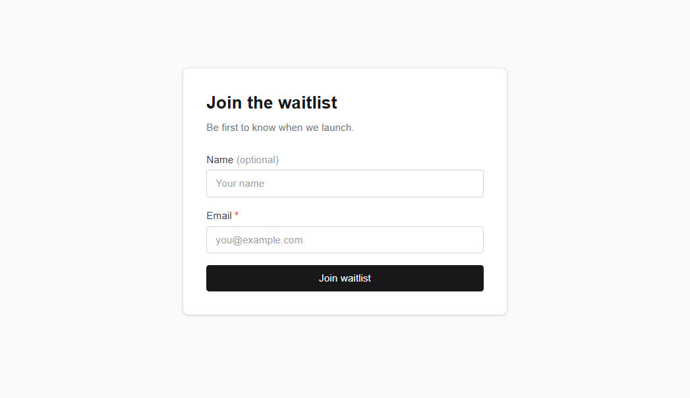
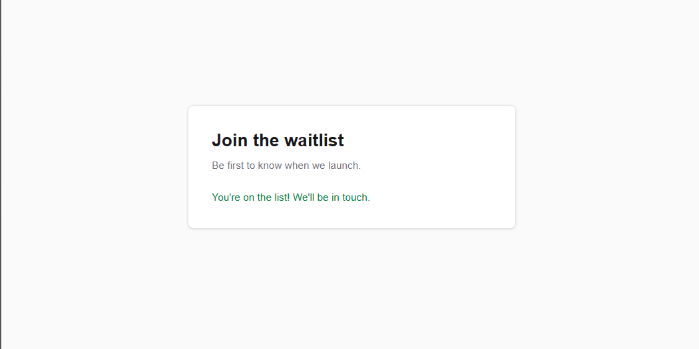
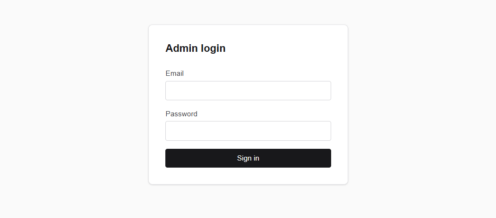
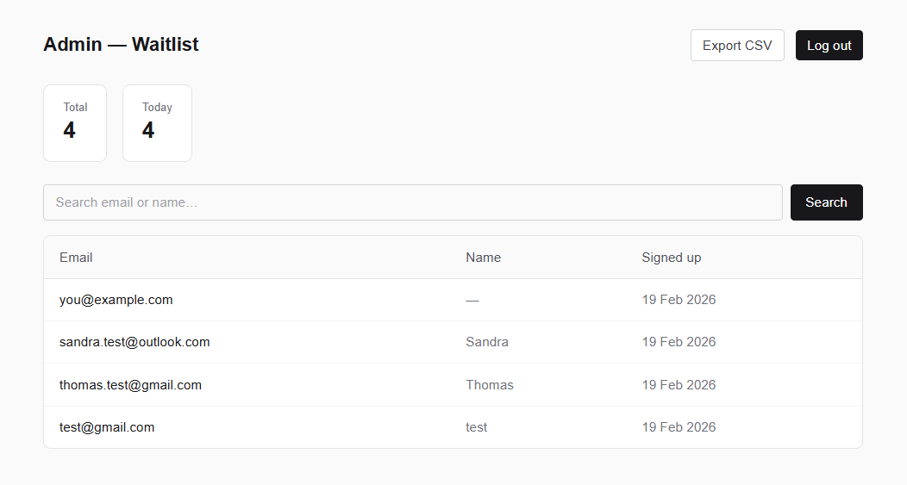

# mvp-demo# Waitlist + Admin Dashboard (Demo)

Live demo: https://mvp-demo.vercel.app

## What this is
A small MVP demo: public waitlist landing page + admin dashboard to view/search/export signups.

## Features
- Waitlist signup (email + optional name)
- Duplicate email handling
- Admin login (Supabase Auth)
- Protected admin dashboard: list, search, pagination
- CSV export

## Tech stack
- Next.js (App Router), React, TypeScript
- Tailwind CSS
- Supabase (Postgres + Auth)

## Local setup
1) Install

npm install

2. Create .env.local (see .env.local.example)

3. Run

npm run dev

4. Open http://localhost:3000

## Screenshots

